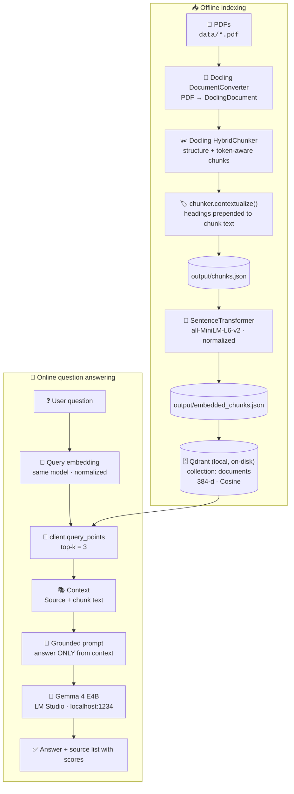

# 📚 Docling RAG

> A fully local **Retrieval-Augmented Generation** pipeline that turns PDFs into a searchable knowledge base and answers questions about them with a grounded, locally hosted LLM. It uses **Docling**, **Sentence Transformers**, **Qdrant** and **Gemma 4**, served through **LM Studio**.


---

## 🚀 Overview

LLMs don't know what's inside your private documents, and when asked anyway they tend to make things up. This project fixes that with **RAG**: it finds the passages that matter to a question and hands only those passages to the model as context, telling it to answer from them alone.

The pipeline is built **from scratch with plain Python scripts** instead of a high-level framework like LangChain or LlamaIndex, so every stage is visible and easy to inspect:

- 📄 **Parse** PDFs, including a scanned one, into structured documents with **Docling**
- ✂️ **Chunk** them along the document's structure with Docling's **HybridChunker**
- 🧠 **Embed** each chunk into a 384-dimensional vector with **all-MiniLM-L6-v2**
- 🗄️ **Store** the vectors and their metadata in a local, on-disk **Qdrant** collection
- 🔎 **Retrieve** the top 3 most similar chunks for a question by cosine similarity
- 🤖 **Generate** an answer with **Gemma 4 E4B** running locally in **LM Studio**, limited to the retrieved context
- 🛡️ **Refuse** questions the documents can't answer, with a fixed fallback message

Nothing leaves your machine. The parsing, embedding, vector search and generation all run locally.

The sample corpus in `data/` is a small set of 3D-printing documents: a printer user manual, filament data sheets, a slicer guide and a **scanned** maintenance log.

---

## 🏗️ Architecture



---

## ⚙️ How It Works

### 1. 📄 Document Processing (`ingest.py`)

Every `*.pdf` in `data/` goes through Docling's `DocumentConverter`, which produces a structured **`DoclingDocument`** with headings, paragraphs, lists and tables, not just flat text. The default PDF pipeline also handles the scanned page in `scanned_maintenance_log.pdf`, whose text appears in the generated chunks.

### 2. ✂️ Chunking (`ingest.py`)

The `DoclingDocument` is split with Docling's **`HybridChunker`**, using its default settings:

- **Structure first:** chunks follow the document hierarchy (sections, tables, lists).
- **Token-aware:** the default tokenizer is `sentence-transformers/all-MiniLM-L6-v2`, the same model used for embedding. The chunk limit is read from that model's `max_seq_length`, which is **256 tokens**.
- **`merge_peers=True`:** undersized neighbouring chunks that share the same headings are merged.
- **No fixed character size or sliding-window overlap** is configured. Chunk boundaries come from the document's structure.

Each chunk is then passed through **`chunker.contextualize(chunk)`**, which **prepends its section headings** to the text. That way a chunk like a table of error codes still carries its `6. Error Codes` heading when it's embedded.

Each record saved to `output/chunks.json` looks like this:

```json
{
  "id": "nova_x1_user_manual_6",
  "text": "6. Error Codes\nE01 - Hotend heating failed. E02 - Bed heating failed. ...",
  "source": "nova_x1_user_manual.pdf",
  "headings": ["6. Error Codes"]
}
```

On the sample corpus this produces **30 chunks** from 6 PDFs.

### 3. 🧠 Embedding Generation (`embed.py`)

| Setting | Value |
|---|---|
| Model | `sentence-transformers/all-MiniLM-L6-v2` |
| Dimension | **384** |
| Normalization | `normalize_embeddings=True` (unit-length vectors) |
| Batching | `SentenceTransformer.encode` default |
| Input | the contextualized chunk `text` |
| Output | `output/embedded_chunks.json` (chunks + `embedding` field) |

### 4. 🗄️ Vector Storage (`vector_db.py`)

- **Qdrant in local embedded mode**: `QdrantClient(path="qdrant_db")`. There's no server process, and data is persisted to `./qdrant_db/`.
- **Collection:** `documents`, created only if it doesn't already exist.
- **Vector config:** `size=384`, `distance=Distance.COSINE`.
- **Points:** one `PointStruct` per chunk, with an integer ID (`0…N-1`) and this payload:

  ```text
  chunk_id · text · source · headings
  ```

- Inserted with `client.upsert(...)`, so re-running overwrites points with the same IDs.

### 5. 🔎 Retrieval (`retrieve.py`, `rag.py`)

1. The question is embedded with the **same model**, also normalized.
2. Qdrant is searched with `client.query_points(collection_name="documents", query=..., limit=3)`.
3. The **top 3** points come back ranked by cosine similarity score, with their full payload.

`retrieve.py` is a standalone retrieval check. It runs a hard-coded question (`"What are the error codes on the Nova X1?"`) and prints each hit's score, source and text.

### 6. 🤖 Generation (`rag.py`)

The retrieved chunks are formatted as `Source: <file>\n<text>`, joined with `---` separators, and placed into a **grounding prompt**:

```text
You are a helpful assistant answering questions about the user's documents.

Answer the question using ONLY the provided context.

If the answer cannot be found in the context, say:
"I couldn't find that information in the provided documents."

Do not invent information.

Context:
{context}

Question:
{question}
```

The prompt is sent as a single user message to LM Studio's **OpenAI-compatible** endpoint `http://localhost:1234/v1/chat/completions`, using model `google/gemma-4-e4b` and **`temperature: 0.2`**. The script prints the answer, followed by the **source file and similarity score** of each retrieved chunk.

---

## 🗂️ Project Structure

```text
docling_test/
├── data/                          # 📄 Source PDFs (sample 3D-printing corpus)
│   ├── nova_x1_user_manual.pdf
│   ├── filapro_pla_datasheet.pdf
│   ├── filapro_petg_datasheet.pdf
│   ├── filapro_tpu_datasheet.pdf
│   ├── slicer_settings_guide.pdf
│   └── scanned_maintenance_log.pdf   # scanned document
├── ingest.py                      # 1️⃣ PDF → DoclingDocument → HybridChunker → output/chunks.json
├── embed.py                       # 2️⃣ chunks → all-MiniLM-L6-v2 vectors → output/embedded_chunks.json
├── vector_db.py                   # 3️⃣ create Qdrant collection + upsert points
├── retrieve.py                    # 🔎 standalone semantic-search check (top-3)
├── rag.py                         # 🤖 interactive RAG: retrieve → prompt → Gemma via LM Studio
├── src/docling_test/
│   ├── __init__.py                # package entry point (placeholder `main`)
│   └── convert.py                 # 🧪 standalone Docling experiment: PDF → Markdown files in output/
├── output/                        # generated JSON (git-ignored)
├── qdrant_db/                     # local Qdrant storage (git-ignored)
├── pyproject.toml                 # project metadata + dependencies
├── uv.lock                        # locked dependency versions
└── .python-version                # 3.13.15
```

| File | Input | Output |
|---|---|---|
| `ingest.py` | `data/*.pdf` | `output/chunks.json` |
| `embed.py` | `output/chunks.json` | `output/embedded_chunks.json` |
| `vector_db.py` | `output/embedded_chunks.json` | Qdrant collection `documents` in `qdrant_db/` |
| `retrieve.py` | hard-coded question + Qdrant | top-3 chunks printed to the terminal |
| `rag.py` | question from `input()` + Qdrant + LM Studio | grounded answer + sources |
| `src/docling_test/convert.py` | `data/*.pdf` | `output/<name>.md` (not used by the RAG pipeline) |

---

## 🧰 Tech Stack

| Component | Technology | Role |
|---|---|---|
| Language / env | **Python 3.13** + **uv** | runtime and dependency management (`uv.lock`) |
| Document processing | **Docling** `DocumentConverter` | PDF → structured `DoclingDocument` |
| Chunking | **Docling** `HybridChunker` | structure-aware, token-aware chunks with heading context |
| Embeddings | **Sentence Transformers**: `all-MiniLM-L6-v2` | 384-d normalized dense vectors |
| Vector database | **Qdrant** (`qdrant-client`, local mode) | on-disk vector storage + cosine similarity search |
| LLM | **Gemma 4 E4B** (`google/gemma-4-e4b`) | grounded answer generation |
| Local inference | **LM Studio** (OpenAI-compatible server) | serves the LLM at `localhost:1234` |
| HTTP | **requests** | calls the LM Studio chat-completions API |

---

## 📦 Installation

### Prerequisites

- **Python 3.13.15+** (`requires-python = ">=3.13.15"`, pinned in `.python-version`)
- **[uv](https://docs.astral.sh/uv/)**
- **[LM Studio](https://lmstudio.ai/)** with the `google/gemma-4-e4b` model downloaded (only needed for `rag.py`)

### Setup

```bash
git clone https://github.com/YoussefIEissa/docling-rag.git
cd docling-rag
uv sync
```

`uv sync` creates `.venv/` and installs the locked dependencies from `uv.lock`. The first run of the pipeline also downloads the Docling models and `all-MiniLM-L6-v2` from Hugging Face.

---

## ▶️ Usage

Run the scripts **from the project root**, in this order. They use relative paths (`data/`, `output/`, `qdrant_db/`).

```bash
# 1. Parse + chunk all PDFs in data/          → output/chunks.json
uv run python ingest.py

# 2. Embed every chunk                         → output/embedded_chunks.json
uv run python embed.py

# 3. Load vectors into the local Qdrant DB     → qdrant_db/ (collection "documents")
uv run python vector_db.py

# 4. (Optional) Sanity-check retrieval with a built-in question
uv run python retrieve.py
```

Then start the LLM and ask questions:

1. Open **LM Studio**, load **`google/gemma-4-e4b`**, and start the **local server** on port **1234**.
2. Run:

```bash
# 5. Ask a question (one per run)
uv run python rag.py
```

> ℹ️ Qdrant's local mode allows **one client at a time** on `qdrant_db/`, so run the scripts one after another, not at the same time.

---

## 🔧 Configuration

All configuration lives as constants at the top of each script. There's no `.env` or config file.

| Setting | Value | Defined in |
|---|---|---|
| Input folder | `data/` (`*.pdf`) | `ingest.py` |
| Chunk output | `output/chunks.json` | `ingest.py`, `embed.py` |
| Embedded output | `output/embedded_chunks.json` | `embed.py`, `vector_db.py` |
| Embedding model | `sentence-transformers/all-MiniLM-L6-v2` | `embed.py`, `retrieve.py`, `rag.py` |
| Qdrant storage | `QdrantClient(path="qdrant_db")` | `vector_db.py`, `retrieve.py`, `rag.py` |
| Collection | `documents` | `vector_db.py`, `retrieve.py`, `rag.py` |
| Vector size / metric | `384` / `COSINE` | `vector_db.py` |
| Top-k | `3` | `retrieve.py`, `rag.py` |
| LLM model | `google/gemma-4-e4b` | `rag.py` (`LLM_MODEL`) |
| LLM endpoint | `http://localhost:1234/v1/chat/completions` | `rag.py` (`LM_STUDIO_URL`) |
| Temperature | `0.2` | `rag.py` |

> ⚠️ If you change the embedding model, update it in **all three** scripts and change the vector `size` in `vector_db.py` to match. The collection is only created when it doesn't exist yet, so you'll also need to delete `qdrant_db/` to rebuild it.

---

## 💡 Example

Here's how a question about the printer flows through the system, using the question built into `retrieve.py`:

```text
❓ Question
   "What are the error codes on the Nova X1?"
        │
        ▼
🧠 Embedding  ── all-MiniLM-L6-v2, normalized → 384-d vector
        │
        ▼
🔎 Qdrant     ── query_points(collection="documents", limit=3), cosine similarity
        │
        ▼
📚 Context    ── the indexed chunk containing the answer:
        │
        │      Source: nova_x1_user_manual.pdf
        │      6. Error Codes
        │      E01 - Hotend heating failed. E02 - Bed heating failed.
        │      E03 - Thermal runaway detected. E04 - Filament runout.
        │      E05 - Auto-level probe failure. E06 - Wi-Fi module not detected.
        │
        ▼
🤖 Gemma 4 E4B (LM Studio) ── "Answer using ONLY the provided context"
        │
        ▼
✅ Answer + SOURCES list (file name + similarity score per retrieved chunk)
```

The chunk shown above is real content from `output/chunks.json`. Its `6. Error Codes` prefix was added by `chunker.contextualize()`, which helps semantic search match the question to the right section.

If a question has no support in the documents, the prompt tells the model to reply:

```text
I couldn't find that information in the provided documents.
```

`rag.py` prints its result in this shape:

```text
============================================================
ANSWER
============================================================
<model answer>

============================================================
SOURCES
============================================================
- <source.pdf> (score: <cosine similarity>)
- ...
```

---

## 🔬 Technical Architecture

| Stage | Implementation | Code |
|---|---|---|
| **Ingestion** | Iterates `Path("data").glob("*.pdf")` | `ingest.py` |
| **Parsing** | `DocumentConverter().convert(pdf).document` → `DoclingDocument` | `ingest.py` |
| **Chunking** | `HybridChunker().chunk(doc)` (defaults: MiniLM tokenizer, 256-token limit, `merge_peers=True`) | `ingest.py` |
| **Enrichment** | `chunker.contextualize(chunk)` prepends headings; `chunk.meta.headings` kept as metadata; ID = `<pdf_stem>_<i>` | `ingest.py` |
| **Embedding** | `SentenceTransformer(...).encode(texts, normalize_embeddings=True)` | `embed.py` |
| **Vector storage** | `create_collection(VectorParams(size=384, distance=COSINE))` + `upsert(PointStruct...)` | `vector_db.py` |
| **Retrieval** | Normalized query vector → `query_points(..., limit=3).points` | `retrieve.py`, `rag.py` |
| **Context** | `"Source: {source}\n{text}"` blocks joined by `\n\n---\n\n` | `rag.py` |
| **Generation** | `requests.post` to LM Studio `/v1/chat/completions`, `temperature=0.2`, reads `choices[0].message.content` | `rag.py` |

Each stage writes a **plain JSON intermediate** (`chunks.json` → `embedded_chunks.json`). That keeps stages decoupled: you can open the chunks before embedding them, or re-index Qdrant without re-parsing the PDFs.

---

## 🧠 Engineering Decisions

- **Parse into structure before embedding.** Docling builds a `DoclingDocument` with real headings and tables, so chunking can follow the document's logical layout instead of cutting at arbitrary character offsets.
- **HybridChunker with heading contextualization.** Chunks follow section boundaries, and each chunk's embedded text carries its headings. Short fragments like a single table row or a one-line note still embed with their section's meaning.
- **Chunker and embedder share a tokenizer.** The chunker's default tokenizer is `all-MiniLM-L6-v2`, the same model used for embeddings, so chunks are measured in the embedder's own tokens and capped at its 256-token input window.
- **Normalized embeddings + cosine distance.** Documents and queries are both L2-normalized with the same model, so cosine similarity scores are comparable across queries.
- **Embedded Qdrant.** `QdrantClient(path=...)` gives a real vector database API (collections, payloads, `query_points`) with no server to run.
- **Metadata in the payload.** Storing `source`, `headings` and `chunk_id` with every vector lets `rag.py` cite which file each piece of context came from.
- **Local LLM through an OpenAI-compatible API.** LM Studio serves Gemma locally behind a standard chat-completions endpoint, so the RAG code only needs `requests`, and the model is a one-line change.
- **Strict grounding prompt + low temperature.** The prompt requires answers from the context only, gives an exact fallback sentence, and uses `temperature=0.2` to reduce made-up details.

---

## ⚠️ Limitations

This is a learning-focused pipeline. It currently does **not** include:

- **Reranking:** results are ranked by raw vector similarity only.
- **Hybrid / keyword search:** retrieval is dense-only, with no BM25 or sparse vectors.
- **Metadata filtering:** payloads are stored but never used as search filters.
- **Configurable top-k:** retrieval is fixed at `limit=3` with no score threshold.
- **Incremental indexing:** point IDs are sequential integers, so changing the corpus means re-running the whole pipeline (and possibly deleting `qdrant_db/`).
- **Chat interface or API:** `rag.py` answers one question per run from the terminal, with no conversation memory.
- **Inline citations:** sources are printed after the answer, not tied to individual statements.
- **Automated evaluation:** there are no retrieval or answer-quality metrics.
- **Shared configuration:** model names and paths are repeated across scripts.
- **Tests and error handling:** for example, `rag.py` fails with a `requests` error if LM Studio isn't running.
- **Unused dependencies:** `chromadb` and `streamlit` are listed in `pyproject.toml` but not imported anywhere yet.

---

## 🔮 Future Improvements

*These are planned ideas, **not** current features.*

- 📊 **Retrieval evaluation:** a small question/answer set with hit-rate / MRR metrics
- 🥇 **Reranking:** a cross-encoder pass over a larger candidate set
- 🔀 **Hybrid search:** combine dense vectors with Qdrant sparse/BM25 vectors
- 🏷️ **Metadata filtering:** restrict search by `source` or `headings`
- ✂️ **Chunking tuning:** try different `max_tokens` values or a larger embedding model
- 📌 **Inline citations:** have the model cite `chunk_id`s or sources per claim
- ⚙️ **Central config:** one config module or `.env` for models, paths and top-k
- 🖥️ **UI / API:** a Streamlit chat front-end (already a dependency) or a FastAPI service
- 🔁 **Incremental ingestion:** deterministic UUIDs per chunk so new documents can be added without a full rebuild
- 🐳 **Docker:** a containerized setup with a Qdrant server

---

## 🎓 AI Engineering Concepts Demonstrated

- **RAG architecture:** a complete retrieve-then-generate loop, built without a framework
- **Layout-aware document processing:** Docling parsing of digital and scanned PDFs
- **Structure-aware chunking:** HybridChunker with heading contextualization
- **Dense embeddings:** normalized sentence embeddings with a tokenizer-aligned chunker
- **Vector databases:** collection schema, payload design, upserts and similarity queries in Qdrant
- **Semantic retrieval:** top-k cosine similarity search
- **Context engineering:** source-labelled context blocks inside a grounding prompt
- **Hallucination mitigation:** context-only instructions, an explicit refusal fallback, low temperature
- **Local LLM inference:** Gemma 4 served through LM Studio's OpenAI-compatible API
- **Modular pipeline design:** independent stages connected by inspectable JSON artifacts

---

## 👤 Author

**Youssef Eissa**

GitHub: [https://github.com/YoussefIEissa](https://github.com/YoussefIEissa)
